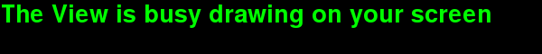
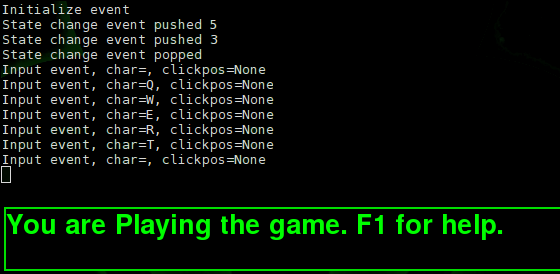

# MVC Game Design Pattern

This document details how to implement the MVC design pattern for games.

By decoupling the View, the Controller and the Model, and using an event manager to communicate between them, we make the code more maintainable, and it allows us to implement other neat controllers like:

* a View for reduced graphics to fit on mobile devices.
* a Controller for touch screens devices.
* Networking.

_For more on this design pattern, see [references](#references)_

# The coupling

Here we see how our our model pieces are connected:

                 +------------+
                 |    Model   |
      >---->---->+------------+<----<----<
      |          .            .          |
      ^          .            .          ^
      |          +------------+          |
      ^          |   Events   |          ^
      |          +------------+          |
      ^          .            .          ^
      |          .            .          |
      ^          .            .          ^
      +------------+        +------------+
      |    View    |        | Controller |
      +------------+        +------------+

* Model
    * job: stores game map, player and npc data, game settings. Everything data.
    * is not aware of what Views or Controllers are looking at it.
    * can post and listen for events.
* View
    * job: draws on screen what the model represents.
    * is strongly aware of the model and it's values.
    * can post and listen for events.
* Controller
    * job: taking keyboard and mouse input and posts matching events.
    * is strongly aware of the model and it's values.
    * can post and listen for events.
* Events
    * job: coordinates messages between listeners.

This shows that even if the Controller does not know anything about the player's health, what level we are on, it still only catches key presses and sends out events to match.

Nor does the View care how the player is controlling our game. The View only cares about showing on screen the current model state. Since the View also listens to posted events, it will pick up mouse clicks and key presses that integrate into it's widgets.

# The code

We will implement our pattern in [Python](#references). We will create the Model, the View and the Controller. We will also create the file that hosts instances of each and links them together.

We will use the [PyGame](#references) library for our View's graphics. The MVC design will allow us to replace PyGame with another graphics library if that is our wish. The game's behaviour will stay the same since the View does not control how the game runs, cutting out many potential bugs when implementing another View.

_our coding style is taken from [PEP 8](#references). Read it. :)_

We will now create:

* model.py, the brain.
* view.py, draws what the brain thinks.
* controller.py, tells the brain what to do.
* eventmanager.py, coordinates all our senses.
* main.py, glues all of the above into a running instance.

## The Model

Let's start with the brain of our game. Check this out:

**Model.py**

~~~{.python}

    import pygame
    from eventmanager import *

    class GameEngine(object):
        """
        Tracks the game state.
        """

        def __init__(self, evManager):
            """
            evManager (EventManager): Allows posting messages to the event queue.
            
            Attributes:
            running (bool): True while the engine is online. Changed via QuitEvent().
            """
            
            self.evManager = evManager
            evManager.RegisterListener(self)
            self.running = False

        def notify(self, event):
            """
            Called by an event in the message queue. 
            """

            if isinstance(event, QuitEvent):
                self.running = False

        def run(self):
            """
            Starts the game engine loop.

            This pumps a Tick event into the message queue for each loop.
            The loop ends when this object hears a QuitEvent in notify(). 
            """
            self.running = True
            self.evManager.Post(InitializeEvent())
            while self.running:
                newTick = TickEvent()
                self.evManager.Post(newTick)

~~~

You can see the Model takes an instance of Event Manager, this is so we can post() messages from the Model. Any messages sent there are received into notify(), this includes messages posted by other instances. The run() method simply tells all other message listeners to get ready for action (InitializeEvent) and then starts posting TickEvents, forever, until it hears a QuitEvent through notify(). note how the Model imports eventmanager (line 1), but no View or Controller! The Model is blind to what is watching or controlling it, that is done all through the message pump.

## The View

Next up we code the View. First you will note it imports eventmanager, and the model. We call this a strong reference to the model, because we explicitly code against the model's properties. Because we are only a View, we should try and limit our selves to only read the model data, and avoid calling it's functions directly. This ensures our View is not tightly coupled to the Model.

**view.py**

~~~{.python}

    import pygame
    import model
    from eventmanager import *

    class GraphicalView(object):
        """
        Draws the model state onto the screen.
        """

        def __init__(self, evManager, model):
            """
            evManager (EventManager): Allows posting messages to the event queue.
            model (GameEngine): a strong reference to the game Model.
                    
            Attributes:
            isinitialized (bool): pygame is ready to draw.
            screen (pygame.Surface): the screen surface.
            clock (pygame.time.Clock): keeps the fps constant.
            smallfont (pygame.Font): a small font.
            """
            
            self.evManager = evManager
            evManager.RegisterListener(self)
            self.model = model
            self.isinitialized = False
            self.screen = None
            self.clock = None
            self.smallfont = None
        
        def notify(self, event):
            """
            Receive events posted to the message queue. 
            """

            if isinstance(event, InitializeEvent):
                self.initialize()
            elif isinstance(event, QuitEvent):
                # shut down the pygame graphics
                self.isinitialized = False
                pygame.quit()
            elif isinstance(event, TickEvent):
                self.renderall()
                # limit the redraw speed to 30 frames per second
                self.clock.tick(30)
        
        def renderall(self):
            """
            Draw the current game state on screen.
            Does nothing if isinitialized == False (pygame.init failed)
            """
            
            if not self.isinitialized:
                return
            # clear display
            self.screen.fill((0, 0, 0))
            # draw some words on the screen
            somewords = self.smallfont.render(
                        'The View is busy drawing on your screen', 
                        True, 
                        (0, 255, 0))
            self.screen.blit(somewords, (0, 0))
            # flip the display to show whatever we drew
            pygame.display.flip()
            
        def initialize(self):
            """
            Set up the pygame graphical display and loads graphical resources.
            """

            result = pygame.init()
            pygame.font.init()
            pygame.display.set_caption('demo game')
            self.screen = pygame.display.set_mode((600, 60))
            self.clock = pygame.time.Clock()
            self.smallfont = pygame.font.Font(None, 40)
            self.isinitialized = True

~~~

## The Controller

Our controller is simple. It subscribes to the event manager notifications, and then for each TickEvent it will check if there are any key presses. It will post a QuitEvent message if the window is closed, or if the user presses the Escape key. Any other key presses are printed out for debugging.

Notice the Controller also takes a reference to the Model. It's not used yet, but will be once our code grows.

**controller.py**

~~~{.python}

    import pygame
    import model
    from eventmanager import *

    class Keyboard(object):
        """
        Handles keyboard input.
        """

        def __init__(self, evManager, model):
            """
            evManager (EventManager): Allows posting messages to the event queue.
            model (GameEngine): a strong reference to the game Model.
            """
            self.evManager = evManager
            evManager.RegisterListener(self)
            self.model = model

        def notify(self, event):
            """
            Receive events posted to the message queue. 
            """

            if isinstance(event, TickEvent):
                # Called for each game tick. We check our keyboard presses here.
                for event in pygame.event.get():
                    # handle window manager closing our window
                    if event.type == pygame.QUIT:
                        self.evManager.Post(QuitEvent())
                    # handle key down events
                    if event.type == pygame.KEYDOWN:
                        if event.key == pygame.K_ESCAPE:
                            self.evManager.Post(QuitEvent())
                        else:
                            # post any other keys to the message queue for everyone else to see
                            self.evManager.Post(InputEvent(event.unicode, None))

~~~

## The Event Manager

This class coordinates the messages sent between our objects. Each event is a class that inherits from the Event base. Each event can also store additional data if it wishes. The event manager has methods to subscribe to receive messages through a notify(event) call.

_Note the class comments and spacing between classes as per [PEP 8](#references)._

**eventmanager.py**

~~~{.python}

    class Event(object):
        """
        A superclass for any events that might be generated by an
        object and sent to the EventManager.
        """
        
        def __init__(self):
            self.name = "Generic event"
        def __str__(self):
            return self.name
        
        
    class QuitEvent(Event):
        """
        Quit event.
        """
        
        def __init__ (self):
            self.name = "Quit event"
        
        
    class TickEvent(Event):
        """
        Tick event.
        """
        
        def __init__ (self):
            self.name = "Tick event"
        
        
    class InputEvent(Event):
        """
        Keyboard or mouse input event.
        """
        
        def __init__(self, unicodechar, clickpos):
            self.name = "Input event"
            self.char = unicodechar
            self.clickpos = clickpos
        def __str__(self):
            return '%s, char=%s, clickpos=%s' % (self.name, self.char, self.clickpos)
        
        
    class InitializeEvent(Event):
        """
        Tells all listeners to initialize themselves.
        This includes loading libraries and resources.
        
        Avoid initializing such things within listener __init__ calls 
        to minimize snafus (if some rely on others being yet created.)
        """
        
        def __init__ (self):
            self.name = "Initialize event"

    class EventManager(object):
        """
        We coordinate communication between the Model, View, and Controller.
        """
        
        def __init__(self):
            from weakref import WeakKeyDictionary
            self.listeners = WeakKeyDictionary()

        def RegisterListener(self, listener):
            """ 
            Adds a listener to our spam list. 
            It will receive Post()ed events through it's notify(event) call. 
            """
            
            self.listeners[listener] = 1

        def UnregisterListener(self, listener):
            """ 
            Remove a listener from our spam list.
            This is implemented but hardly used.
            Our weak ref spam list will auto remove any listeners who stop existing.
            """
            
            if listener in self.listeners.keys():
                del self.listeners[listener]
            
        def Post(self, event):
            """
            Post a new event to the message queue.
            It will be broadcast to all listeners.
            """
            
            if not isinstance(event, TickEvent):
                # print the event (unless it is TickEvent)
                print(str(event))
            for listener in self.listeners.keys():
                listener.notify(event)
~~~

## Glue them together

Now that we have our classes coded, we can create the entry point which creates instances of our classes, binds them together and starts the main Model loop.

**main.py**

~~~{.python}

import eventmanager
import model
import view
import controller

def run():
    evManager = eventmanager.EventManager()
    gamemodel = model.GameEngine(evManager)
    keyboard = controller.Keyboard(evManager, gamemodel)
    graphics = view.GraphicalView(evManager, gamemodel)
    evManager.RegisterListener(gamemodel)
    evManager.RegisterListener(keyboard)
    evManager.RegisterListener(graphics)
    gamemodel.run()

if __name__ == '__main__':
    run()

~~~

## First run

The code for this demo lives in the [code-01](code-01/) directory. You run it through Python:

    :$ python main.py 
    Initialize event
    Input event, char=Q, clickpos=None
    Input event, char=W, clickpos=None
    Input event, char=E, clickpos=None
    Input event, char=R, clickpos=None
    Input event, char=T, clickpos=None
    Input event, char=Y, clickpos=None
    Quit event

The term output shows the Initialize event was posted, that was when the View create it's window and started drawing itself on every TickEvent. Then some Input events fired while we press keys on the keyboard. Finally the Quit event fired when we pressed Escape.

# Game states

The Game Model needs to have multiple game states, like:

* playing
    * The game is in play.
    * Controls react to the playtime context.
* dialogue
    * The screen shows game storyline.
    * The game is not running.
    * Controls only respond to the dialog context.
* menus
    * The user can select a profile to play or continue play.
    * The user can select to view the settings or other pages.
    * The game is not running. 
    * Controls only respond to the menu context.
* settings
    * The user can toggle audio or music.
    * The game is not running.
    * Controls only respond to the settings context.
* intro
    * Shows opening screen.
* help
    * Display a game help overlay.

Since our View and Controller has strong links to the Model, both can look at
the Model state, and decide what user keys to process, and what to draw.

That is their domain, and their job.

## The state machine

We use a stack based state machine to track these game states.

_What is a state machine?_

It is a fancy name for "a list of values, Last one In, First one Out." LIFO.

Think of it like a stack of dinner plates.

              ===     <- we have a green plate on the table
            #######   <- our wooden breakfast table

When we peek() at the top plate we see it is green, so we draw and react to events that mean "our game is busy playing".

When we push() a red plate on top of the stack, we draw and do things that mean "the game is now paused". 

              ===     <- we now see a red plate on top of the stack
              ===     ... green plate
            #######   ... table

To unpause we simply pop() the top most plate off the stack, and we can now see the green plate again. Our game carries on playing.

**Why would we do this?**

Because this allows us to easily unwind the stack to escape from game menus, options, dialogue screens and so forth. The player can open an arbitrary amount of menus, dialogues and screens, and it will unwind back to the beginning.

All our View needs to do is draw whatever the current state is. All our Controller needs to do is handle input for the current state. 

We can use this to show game dialogue for more than one screen. Consider this:

              ===     ... dialogue text #1
              ===     ... dialogue text #2
              ===     ... dialogue text #3
              ===     ... game play
              ===     ... main menu
            #######   ... 

The View draws the dialogue text #1, and when the user presses the "anykey" we pop the stack and suddenly the View draws text #2. The Controller knows it's a dialogue mode and knows to pop the stack on the "anykey" press. Press enough keys, pop enough plates, we move through the storyline and get back to the game.

## Implementing the game states

This section will go quick. I will summarize the changes and you can go look at the full code files by yourself. :]

**[eventmanager.py](code-02/eventmanager.py) changes**

We begin by adding a StateChangeEvent class. This gal will carry the signal around to push new states, or pop the current state.

**[model.py](code-02/model.py) changes**

We add the StateMachine class to the model, it is pretty basic and the code comments explains it all. We add a line in initialize:

~~~python
def __init__(self, evManager):
    self.state = StateMachine()
~~~

In notify() we do a check if the event is a StateChangeEvent, and we manipulate the state accordingly:

~~~python
def notify(self, event):
    if isinstance(event, StateChangeEvent):
        # pop request
        if not event.state:
            # false if no more states are left
            if not self.state.pop():
                self.evManager.Post(QuitEvent())
        else:
            # push a new state on the stack
            self.state.push(event.state)
~~~

Then in the run() call we push our first state on the stack, just before we start posting TickEvents.

~~~python
def run(self):
    self.evManager.Post(InitializeEvent())
    self.state.push(STATE_MENU)
    while self.running:
        newTick = TickEvent()
        self.evManager.Post(newTick)
~~~

**[view.py](code-02/view.py) changes**

Next we update our view to show a different message depending on what state the Model is in. I coded a render call for each state, it makes maintaining code easier to separate drawing calls like this. The hook of our change lies in notify():

~~~python
elif isinstance(event, TickEvent):
    currentstate = self.model.state.peek()
    if currentstate == model.STATE_MENU:
        self.rendermenu()
    if currentstate == model.STATE_PLAY:
        self.renderplay()
    if currentstate == model.STATE_HELP:
        self.renderhelp()
~~~

**[controller.py](code-02/controller.py) changes**

And finally we update our controller to handle keyboard input per state.

* menu
    * spacebar plays the game
    * escape quits
* play
    * F1 shows help
    * escape goes back to the menu
    * any other key posts as InputEvent
* help
    * spacebar, escape or enter goes back to the game

The hook for this change lies here:

~~~python
def notify(self, event):
    if isinstance(event, TickEvent):
        if event.type == pygame.KEYDOWN:
            currentstate = self.model.state.peek()
            if currentstate == model.STATE_MENU:
                self.keydownmenu(event)
            if currentstate == model.STATE_PLAY:
                self.keydownplay(event)
            if currentstate == model.STATE_HELP:
                self.keydownhelp(event)
~~~

Notice how we fork out each model state key press to it's own call, this make for easy changes to each state.

When you run this code, you will notice the game starts off in the menu. Spacebar takes you to the play state, where all other key presses get posted (as seen output in the terminal).

    :$ python main.py
    Initialize event
    State change event pushed 5
    Input event, char=Q, clickpos=None
    Input event, char=W, clickpos=None
    Input event, char=E, clickpos=None
    Input event, char=R, clickpos=None
    Input event, char=T, clickpos=None
    Input event, char=Y, clickpos=None
    State change event pushed 3
    State change event popped
    State change event popped
    State change event popped
    Quit event

# Rendering the level

_This section is still Work In Progress :]_ 

We will use the Tiled map editor to create game levels, and the PyTMX library for reading the level files - See [References](#references) below for links to these great pieces of code :]

The best way to learn a library is to work through the included demo code.

Read through the demo and mentally note the classes it uses. Then browse those
class sources and go through their properties and functions. 

This will take some time, but it is rewarding when you use the library someone else has worked on. We can only thank them for their hard work!

# License

    Copyright (C) 2013 Wesley Werner

    This program is free software: you can redistribute it and/or modify
    it under the terms of the GNU General Public License as published by
    the Free Software Foundation, either version 3 of the License, or
    any later version.

    This program is distributed in the hope that it will be useful,
    but WITHOUT ANY WARRANTY; without even the implied warranty of
    MERCHANTABILITY or FITNESS FOR A PARTICULAR PURPOSE.  See the
    GNU General Public License for more details.

You should receive a copy of the GNU General Public License along with this program. If not, see [http://www.gnu.org/licenses/](http://www.gnu.org/licenses/).

# Contact

You may contact me at [wez@[anti-spam]darknet.co.za](mailto:wez@[anti-spam]darknet.co.za)

# References

* [http://python.org](http://python.org): The programming language.
* [http://pygame.org](http://pygame.org): Pygame is a set of Python modules designed for writing games.
* [http://www.python.org/dev/peps/pep-0008](http://www.python.org/dev/peps/pep-0008): PEP 8 Style Guide for Python Code
* [http://mapeditor.org](http://mapeditor.org): A 2D tiled map editor.
* [https://github.com/bitcraft/PyTMX](https://github.com/bitcraft/PyTMX): A python library for reading .tmx map files.
* [http://ootips.org/mvc-pattern.html](http://ootips.org/mvc-pattern.html): A nice MVC description. Here I replaced the weakly-typed references with our event manager.
* [http://ezide.com/games/writing-games.html](http://ezide.com/games/writing-games.html): touches on a basic implementation which this document started from. It expands the model to include networking support, which I have omitted.
